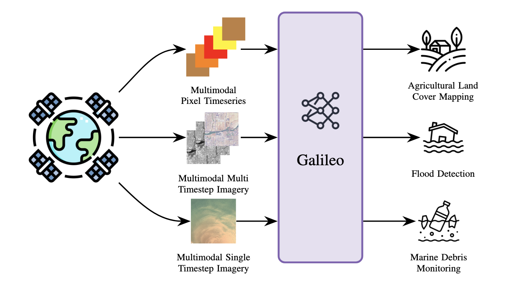
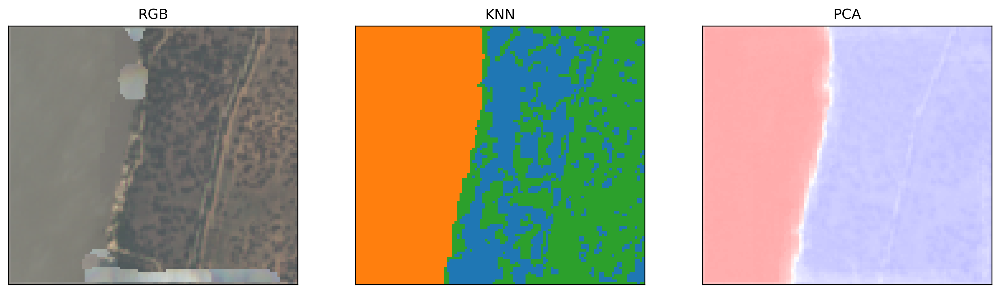

# Galileo

Learning Global and Local Features in Pretrained Remote Sensing Models



Galileo is a family of pretrained remote sensing models. These models have been pretrained on a diversity of remote sensing inputs, and perform well on a range of benchmark tasks. For more information, please see our [paper](https://arxiv.org/abs/2502.09356).

### Using Galileo

Galileo can be loaded either from `src`, or from `single_file_galileo.py` for easy porting to other codebases:

```python
from single_file_galileo import Encoder as SingleFileEncoder
from src.galileo import Encoder


src_model = Encoder.load_from_folder(DATA_FOLDER / "models/nano")
sf_model = SingleFileEncoder.load_from_folder(
    DATA_FOLDER / "models/nano", device=torch.device("cpu")
)

for model_p, sf_model_p in zip(src_model.parameters(), sf_model.parameters()):
    assert torch.equal(model_p, sf_model_p)
```

The inputs to Galileo are described in the [`MaskedOutput`](src/masking.py#L116):

```python
class MaskedOutput(NamedTuple):
    """
    A mask can take 3 values:
    0: seen by the encoder (i.e. makes the key and value tokens in the decoder)
    1: not seen by the encoder, and ignored by the decoder
    2: not seen by the encoder, and processed by the decoder (the decoder's query values)
    """

    space_time_x: torch.Tensor  # [B, H, W, T, len(SPACE_TIME_BANDS)]
    space_x: torch.Tensor  # [B, H, W, len(SPACE_BANDS)]
    time_x: torch.Tensor  # [B, T, len(TIME_BANDS)]
    static_x: torch.Tensor  # [B, len(STATIC_BANDS)]
    space_time_mask: torch.Tensor  # [B, H, W, T, len(SPACE_TIME_BANDS_GROUPS_IDX)]
    space_mask: torch.Tensor  # [B, H, W, len(SPACE_BAND_GROUPS_IDX)]
    time_mask: torch.Tensor   # [B, T, len(TIME_BAND_GROUPS_IDX)]
    static_mask: torch.Tensor  # [B, len(STATIC_BAND_GROUPS_IDX)]
    months: torch.Tensor  # [B, T]
```

Each of these bands are described in [`single_file_galileo.py`](single_file_galileo.py#L24).

Alternatively, a [utility function](src/data/utils.py#L36) is provided to transform the bands into `MaskedOutput` objects. This transformation is for a single instance (i.e. it omits the `B` dimension above). This function optionally normalizes the data against the Galileo pre-training statistics.

```python
from src.data.utils import S2_BANDS, construct_galileo_input

t, h, w = 2, 4, 4
normalize = True
s2 = torch.randn((t, h, w, len(S2_BANDS)))
masked_output = construct_galileo_input(s2=s2, normalize=normalize)
```

If you want to see Galileo being used on real data, we also have a [notebook](visualizing_embeddings.ipynb) which generates embeddings for a real training tif file:



### Model weights
The nano model weights are available [on github](data/models/nano).

Other model sizes (including nano) are available [on huggingface](https://huggingface.co/nasaharvest/galileo).

You can download them locally with the following command (you will need to install the `huggingface_hub[cli]` package first):

```bash
hf download nasaharvest/galileo --include "models/**" --local-dir data
```

#### Docker setup

A `Dockerfile` is available to build a container that includes all
dependencies as well as the models, served in a JupyterLab environment. To
build the image:

- Download the [Dockerfile](Dockerfile) locally.
- Change directory on the command line to the folder where you have downloaded
  the file:

  `cd /path/to/folder/with_Dockerfile`

- Assuming you have [Docker](https://docker.com) (or a compatible app like
  `podman`), run:

  ```bash
  docker build -t galileo .
  ```

Once completed, you can run the built image with:

```bash
docker run \
	--rm \
	-ti \
	--gpus all \
	galileo
```

Notes:

- The command above will use GPUs available on the host system, but requires
  the [NVIDIA Container Toolkit](https://docs.nvidia.com/datacenter/cloud-native/container-toolkit/latest/install-guide.html) installed and propertly working. If you do not have or do not want to use the GPU, you can drop the argument.
- As stated above, the image runs fully isolated from the host. If you
  want to connect the running container to a folder, you can use the
  `--volume` argument and map a folder (see the official docs
  [here](https://docker-docs.uclv.cu/storage/volumes/)). In that case, you
  might have to run the container as root, which you can do by adding the
  argument `--user root`. Similarly, if you want to launch `jupyter lab`
  (included), you'll have to map the 8888 port with `--port`.
- This image is built for x86 chips (e.g., Intel, AMD). Apple Silicon users
  will need to add the following flag to their `docker build` and `docker run`
  commands: `--platform linux/amd64`

### Development

**Setup:**
```bash
./setup_dev.sh  # Installs uv, dependencies, and pre-commit hooks
```

**Run tests with coverage:**
```bash
python -m coverage run -m unittest discover -s tests
python -m coverage report -m
```

**Optional - Codecov setup:**
1. Sign in at https://codecov.io with GitHub
2. Add your repo and copy the upload token
3. Add token to GitHub: Settings → Secrets → Actions → New secret
   - Name: `CODECOV_TOKEN`
   - Value: (paste token)

### Reference

If you find this code useful, please cite the following paper:

```
@misc{tseng2025galileolearninggloballocal,
      title={Galileo: Learning Global and Local Features in Pretrained Remote Sensing Models},
      author={Gabriel Tseng and Anthony Fuller and Marlena Reil and Henry Herzog and Patrick Beukema and Favyen Bastani and James R. Green and Evan Shelhamer and Hannah Kerner and David Rolnick},
      year={2025},
      eprint={2502.09356},
      archivePrefix={arXiv},
      primaryClass={cs.CV},
      url={https://arxiv.org/abs/2502.09356},
}
```
